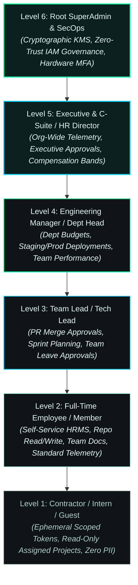

# 🛡️ AirBorne-HRS 6-Level Enterprise Access Control Architecture

An enterprise-grade, zero-trust Role & Attribute-Based Access Control (**RBAC + ABAC**) architecture engineered for **AirBorne-HRS**.

---

## 🏛️ Architectural Overview

The **6-Level Access Hierarchy** strictly enforces the principle of least privilege (PoLP), role separation, contextual environmental checks, and cryptographic break-glass workflows.



---

## 📊 6-Level Enterprise Permission Matrix

| Level | Role Designation | Code Repositories | HRMS & Personal Data | Deployment & Cloud | Security & IAM |
| :---: | :--- | :--- | :--- | :--- | :--- |
| **L1** | **Guest / Intern / Contractor** | Read-only access to assigned sandbox repos; fork & submit PRs | View own basic profile only; zero salary/payroll access | None (Local Dev Sandbox only) | Standard 2FA; Ephemeral session tokens (max 8h) |
| **L2** | **Full-Time Employee (Member)** | Read & Write on assigned squad repositories | Self-service leave, claims, tax declarations, own payroll slips | Dev & Sandbox environment deployments | Mandatory 2FA; corporate SSO integration |
| **L3** | **Team Lead / Tech Lead** | Code review, branch protection bypass on feature branches, merge approvals | Approve team leave, view squad attendance & review performance | Review and trigger Staging CI/CD pipelines | Contextual IP verification + SSO |
| **L4** | **Engineering Manager / Dept Head** | Repository administration, secret scoping, release tagging | Department compensation bands, promotion workflows, budget tracking | Staging & Production deployment sign-offs | Adaptive MFA (step-up authentication on sensitive operations) |
| **L5** | **Executive / HR Director / C-Suite** | Organization-wide auditing, open-source governance oversight | Full employee directory, compensation reviews, organizational analytics | Production telemetry & high-level system architecture visibility | Hardware FIDO2/WebAuthn token required |
| **L6** | **Root SuperAdmin & SecOps** | Full GitHub organization owner, branch protection governance | System audit logs, immutable PII change records (no direct edits without ticket) | Full infrastructure control, KMS master keys, cloud IAM governance | Multi-party break-glass quorum + YubiKey hardware enforcement |

---

## 🔐 Zero-Trust Contextual ABAC Dimensions

In addition to static RBAC levels, every API request is evaluated against **4 real-time Attribute-Based Access Control (ABAC) dimensions**:

1. **Device Trust State**: Evaluates device compliance, disk encryption status, and corporate MDM telemetry.
2. **Geographical & IP Boundary**: Enforces geofencing and zero-trust VPN validation for Level 4+ operations.
3. **Session Authenticator Strength**:
   - `L1 - L3`: Standard TOTP / Authenticator App
   - `L4 - L5`: WebAuthn / Biometric Step-Up
   - `L6`: Dual-party cryptographic quorum with hardware security key (FIDO2 Level 3)
4. **Time & Emergency Ticket (Break-Glass)**: Level 6 root actions require an active, cryptographically signed Incident Ticket ID with automated audit broadcasting.

---

## 📜 Auditability & Compliance

Every authorization decision produces an immutable structured audit log containing:
- **Timestamp (UTC)**
- **Caller Identity (`user_id`, `actor_level`)**
- **Action / Permission Requested**
- **Target Resource / Scoped Entity**
- **Decision (`ALLOW` / `DENY`)**
- **Triggered Policy Rule & Contextual Metadata**

---

```
AIRBORNE PVT. LTD. • ENTERPRISE ACCESS CONTROL ARCHITECTURE
CONFIDENTIAL & PROPRIETARY • 2026
```
